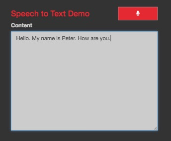

# IBM Watson Speech-to-Text MeteorJS Demo

This demo provides a simplified example how to use the Watson Speech-to-Text service in a MeteorJS app.

In order to use the Watson Speech-to-Text service, you need an [IBM BlueMix](https://console.ng.bluemix.net) account. The
service can be provisioned from within the administrative interface. The MeteorJS app will then connect to this service,
which will provide a transcript of the audio signal recorded on the client-side using your devices microphone.

**More information about the service and the programming API can be found here:**

* [WebSocket Interface / Response Message Description](http://www.ibm.com/smarterplanet/us/en/ibmwatson/developercloud/doc/speech-to-text/websockets.shtml)
* [Complete Service API Reference](http://www.ibm.com/smarterplanet/us/en/ibmwatson/developercloud/speech-to-text/api/v1/)
* [References on Speech Recognition](http://www.ibm.com/smarterplanet/us/en/ibmwatson/developercloud/doc/speech-to-text/science.shtml)

**Screenshot:**



## Authentication

The authentication happens on the server side. The credentials to the Watson Speech-to-Text service should be
provided as environment variables to the MeteorJS server application.

The demo currently uses the environment variables `STT_USERNAME` and `STT_PASSWORD` to retrieve the credentials, but
this can be changed in the `server/main.js`.

The client will require an authorization token in order to open the socket connection to the service (NOTE: this is not
the same as the service credentials). The best way to retrieve an authorization token from the client-side is to use
`Meteor.call` to call a server side method, which retrieves the authorization token using the credentials provided in
the environment.

**Add Required Packages**

```
meteor npm install --save fibers/future
meteor npm install --save watson-developer-cloud
```

**Retrieve the Token**

```
import watson from 'watson-developer-cloud';
import Future from 'fibers/future';

// create config object
var sttConfig = {
    version: 'v1',
    url: 'https://stream.watsonplatform.net/speech-to-text/api', // this is always the same
    username: process.env.STT_USERNAME, // reading environment variables
    password: process.env.STT_PASSWORD
}

Meteor.methods({
	getAuthToken: function() {
	  	var asyncResult = new Future();
	  	var sttAuthService = watson.authorization(sttConfig);
	  	sttAuthService.getToken({ url : sttConfig.url }, function(err, token) {
			if (err) {
				asynResult.throw(err);
		  	} else {
			  	asynResult.return(token)
		  	}
	  	});
	  	return asynResult.wait();
	}
});
```

The result of this `Meteor.call`, is the `authToken` mentioned in the package description.

## Contained Package

The demo application currently contains a local package `ilfrich:watson-speech-to-text`, which wraps the entire microphone
and socket handling in a package providing a callback to be used when the web socket sends a message. Additionally it
provides a microphone wrapper, which handles the signal capturing.

The following code snippets can be used on the client side (browser):


```
// create a new instance of the microphone object
var mic = new Microphone({});

// create socket
handleMicrophone(authToken, model, mic, messageCallback, function(err) {
	if (!err) {
		// start recording
		mic.record();
	}
});

// stop recording and close socket
mic.stop();
```

The `authToken` needs to be retrieved from the server side (see [Authentication](#authentication)).
The last callback of the `handleMicrophone` function is invoked once the socket connection is established.

The `model` parameter defines, which language you want to use. A list of all available models can be found
[here](http://www.ibm.com/smarterplanet/us/en/ibmwatson/developercloud/speech-to-text/api/v1/#get_model). It is
recommended to use the `BroadbandModel`.


The `messageCallback` is invoked with one parameter (`msg`), which is the JSON object de-serialised from the
incoming data from the socket, if it is not an error message.

The `msg` parameter in `messageCallback(msg)` has the following structure:

```
[
  {
    alternatives: [{
      (timestamps): [
        [ Word1, StartTimestamp, EndTimestamp ],
        [ Word2, StartTimestamp, EndTimestamp ]
      ],
      transcript: Sentence,
      (confidence): Percentage
      (word_confidence): [
        [ Word1, ConfidencePercentage ],
        [ Word2, ConfidencePercentage ]
      ],
      (word_alternatives): [
        [{ word: Word1, confidence: ConfidencePercentage }],
        [{ word: Word2, confidence: ConfidencePercentage }]
      ]
    }],
    final: Boolean
  }
]
```

The `final` flag indicates, whether the sentence is finished. All `Percentage` are provided as number between 0.00 (0%)
and 1.00 (100%). The timestamps are provided as number of seconds till the start of the recording / transcript. Keys in
brackets (e.g. `(word_alternatives)` are optional).